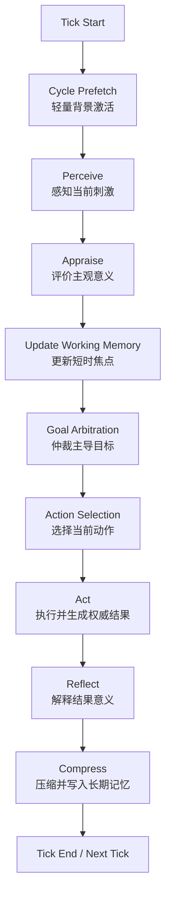
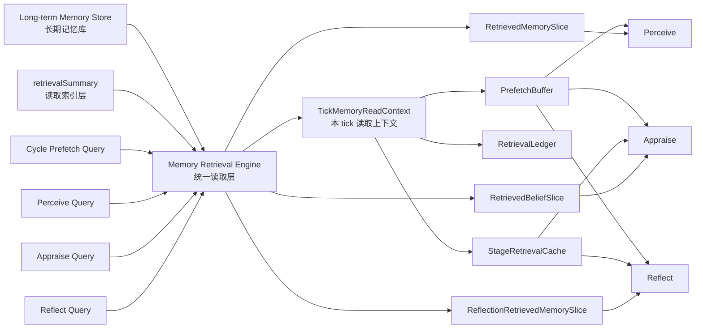
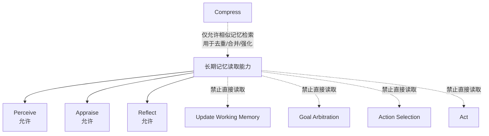
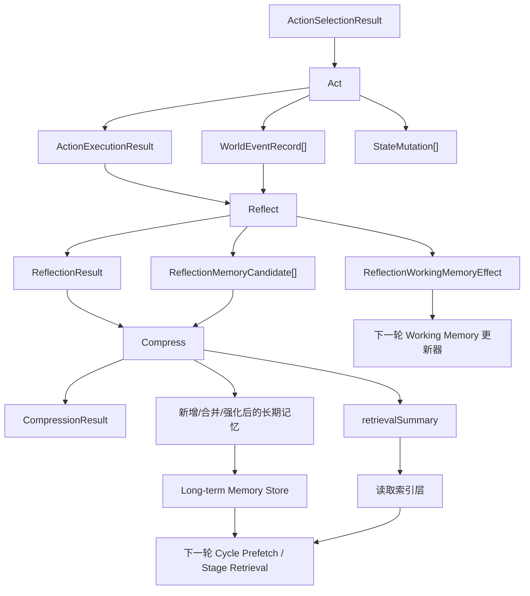
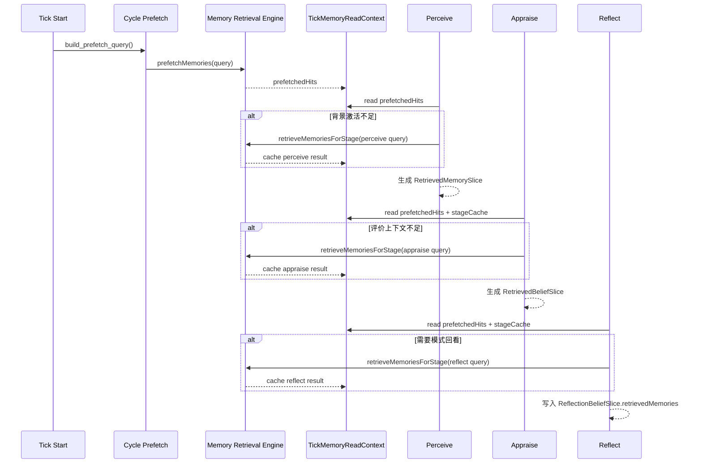

# NPC 认知循环流程图

## 1. 文档目标

本文档以流程图方式展示 `AIWesternTown` 项目当前版本的 NPC 认知循环设计，供设计审阅、实现对齐和后续讨论使用。

本文档不替代 [30-npc-cognition-framework.md](C:/codex/project/AIWesternTown/doc/30-npc-cognition-framework.md) 的正式规范，只负责把已确定的主链路、长期记忆读取支路和执行后闭环可视化。

## 2. 主认知循环总览

## 3. 长期记忆读取支路

## 4. 阶段读取权限图

## 5. 执行后闭环

## 6. 单 Tick 读取顺序

## 7. 审阅重点

- 主链路是否清晰体现 `Perceive -> Appraise -> Update Working Memory -> Goal Arbitration -> Action Selection -> Act -> Reflect -> Compress`
- 长期记忆是否只在 `Perceive / Appraise / Reflect` 读取，而不是所有阶段都可读
- `Act -> Reflect -> Compress -> 下一轮检索` 是否形成稳定闭环
- 同一 tick 内的读取是否通过 `TickMemoryReadContext` 统一管理，而不是阶段各自直接查库
