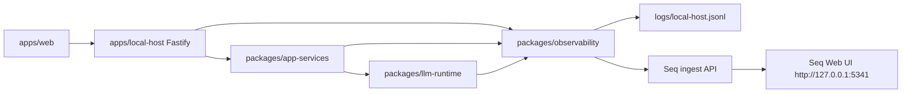

# 本地 JSONL 日志与 Seq 查询设计

## 背景

AIWesternTown 当前已经有 LLM recorder 和部分 debug 记录，但这些能力不能替代本地落盘日志服务：

- recorder 偏运行时内存调试，不适合长期保留和跨进程分析。
- `debug_logs` 持久化面向领域调试数据，不是通用应用日志。
- 当前排查 `AbortError: This operation was aborted` 时，需要看到一次玩家命令从 HTTP 请求、`submitCommand`、LLM 请求、LLM 响应或错误到 HTTP 响应的完整链路。

本设计选择使用流行组件组合，而不是自研弱版日志平台：

- 应用侧日志库：Pino
- 本地落盘格式：JSONL
- 本地 Web 查询服务：Seq

## 目标

1. 通过统一配置控制日志开关、级别、文件路径、LLM 请求/响应内容和 Seq 输出。
2. 后端记录收到的 HTTP/SSE 请求、响应、错误和耗时，不做浏览器主动日志上报。
3. `packages/app-services/src/starter-town-session-runtime.ts` 的 `submitCommand` 关键阶段写结构化日志。
4. `packages/llm-runtime/src/provider/openai-compatible-provider.ts` 写 LLM 请求、响应、错误、AbortError、耗时等日志，且落盘为 JSONL。
5. 提供基础日志函数，业务代码可以在需要位置手动打印结构化日志。
6. 提供本地 Seq Web Server，用于搜索、过滤、统计和查看日志详情。

## 非目标

- 第一版不实现 `/debug/client-log`，浏览器端不主动上报日志。
- 第一版不自研 `/debug/logs` 日志查看器，避免维护一个功能不足的类 Kibana 页面。
- 第一版不接入 Elasticsearch/Kibana；如后续需要，可以复用 JSONL 输出或 Pino transport 扩展。
- 不在 `game-core`、React UI 或持久化 schema 中引入日志文件写入能力。
- 不记录 API key、Authorization header、完整环境变量或其他 secret。

## 总体架构



`packages/observability` 是项目内部的日志边界。业务包只依赖本仓定义的 `Logger` 接口，不直接散落 Pino API。`apps/local-host` 负责读取配置、创建 logger，并注入到 runtime 和 LLM provider。

## 组件设计

### `packages/observability`

职责：

- 封装 Pino，提供本项目统一日志 API。
- 支持 JSONL 文件输出。
- 支持可选 Seq 输出。
- 支持 child logger，自动附加 `module`、`sessionId`、`requestId`、`commandId` 等上下文。
- 支持 no-op logger，用于关闭日志或测试。

建议 API：

```ts
export type LogLevel = "debug" | "info" | "warn" | "error";

export type Logger = {
  debug: (fields: LogFields, message?: string) => void;
  info: (fields: LogFields, message?: string) => void;
  warn: (fields: LogFields, message?: string) => void;
  error: (fields: LogFields, message?: string) => void;
  child: (bindings: LogBindings) => Logger;
};

export type LogFields = Record<string, unknown> & {
  event: string;
};

export type LogBindings = Record<string, unknown>;
```

业务使用示例：

```ts
logger.info({
  event: "submitCommand.start",
  sessionId,
  commandId,
  commandText
});
```

### `apps/local-host`

职责：

- 在统一配置入口解析日志配置。
- 创建根 logger。
- 为每个 HTTP 请求生成或透传 `requestId`。
- 记录 HTTP 请求开始、响应成功、响应失败、SSE 连接和断开。
- 把 child logger 注入 session runtime。
- 提供 `docker-compose.observability.yml` 和说明，方便启动 Seq。

关键事件：

- `http.request`
- `http.response`
- `http.error`
- `sse.connect`
- `sse.disconnect`
- `sse.error`
- `session.create.start`
- `session.create.done`
- `session.create.error`

### `packages/app-services`

职责：

- 不直接写文件。
- 通过注入的 `Logger` 记录业务链路。
- 在 `submitCommand` 中记录关键阶段、耗时和关联 ID。

关键事件：

- `submitCommand.start`
- `submitCommand.worldTick.done`
- `submitCommand.npcCognition.done`
- `llm.visibleOutcome.start`
- `llm.visibleOutcome.done`
- `llm.visibleOutcome.fallback`
- `submitCommand.done`
- `submitCommand.error`

### `packages/llm-runtime`

职责：

- provider 级别记录真实 LLM 调用。
- 记录请求体、响应体和错误体时遵守日志配置。
- 不记录 Authorization header、API key 或完整环境变量。
- AbortError 要以独立错误字段保留，方便在 Seq 中按 `errorName = 'AbortError'` 查询。

关键事件：

- `llm.request`
- `llm.response`
- `llm.error`

## 日志结构

Pino 会自动写入时间、级别等字段。项目侧事件字段保持结构化。

基础字段：

```json
{
  "time": 1778042400000,
  "level": 30,
  "event": "llm.error",
  "module": "llm-runtime",
  "requestId": "req_...",
  "sessionId": "session_...",
  "commandId": "command_...",
  "provider": "openai-compatible",
  "model": "local-model",
  "durationMs": 5021,
  "errorName": "AbortError",
  "errorMessage": "This operation was aborted"
}
```

LLM 请求日志：

```json
{
  "event": "llm.request",
  "provider": "openai-compatible",
  "model": "local-model",
  "url": "http://127.0.0.1:11434/v1/chat/completions",
  "messages": [],
  "options": {
    "temperature": 0.2,
    "maxTokens": 800
  }
}
```

LLM 响应日志：

```json
{
  "event": "llm.response",
  "provider": "openai-compatible",
  "model": "local-model",
  "durationMs": 1234,
  "finishReason": "stop",
  "rawText": "...",
  "usage": {
    "promptTokens": 100,
    "completionTokens": 80
  }
}
```

LLM 错误日志：

```json
{
  "event": "llm.error",
  "provider": "openai-compatible",
  "model": "local-model",
  "durationMs": 5000,
  "errorName": "AbortError",
  "errorMessage": "This operation was aborted",
  "stack": "AbortError: This operation was aborted..."
}
```

大文本字段通过配置截断。截断后增加 `truncated: true` 和原始长度字段，例如 `rawTextLength`。

## 配置设计

配置继续从 `apps/local-host/src/config.ts` 统一解析，来源为 `.env.local` 和进程环境变量。

```env
LOG_ENABLED=true
LOG_LEVEL=debug
LOG_DIR=logs
LOG_FILE=local-host.jsonl
LOG_CONSOLE=true

LOG_SEQ_ENABLED=false
LOG_SEQ_URL=http://127.0.0.1:5341
LOG_SEQ_API_KEY=

LOG_LLM_ENABLED=true
LOG_LLM_INCLUDE_MESSAGES=true
LOG_LLM_INCLUDE_RAW_RESPONSE=true
LOG_LLM_INCLUDE_STACK=true
LOG_LLM_MAX_TEXT_LENGTH=20000
```

默认策略：

- 本地开发默认启用 JSONL 文件日志。
- Seq 默认关闭，避免用户未启动 Seq 时出现网络错误；打开后日志同时写文件和发送 Seq。
- LLM 请求 messages 和 raw response 默认在开发环境启用，但做长度截断。
- secret 字段永远不写入日志，即使打开完整 LLM 日志。

## Seq 本地 Web Server

Seq 作为独立 Docker 服务运行，不嵌入 Node 进程。

建议新增：

```text
docker-compose.observability.yml
```

服务：

- `seq`
  - 镜像：`datalust/seq`
  - 环境变量：`ACCEPT_EULA=Y`
  - 端口：`5341:80`
  - 数据卷：持久化 Seq 数据

启动命令：

```powershell
docker compose -f docker-compose.observability.yml up -d
```

访问地址：

```text
http://127.0.0.1:5341
```

项目侧通过 Pino transport 或独立 sink 将结构化日志发送到 `LOG_SEQ_URL`。

Seq 查询示例：

```text
event = 'llm.error'
```

```text
errorName = 'AbortError'
```

```text
requestId = 'req_...'
```

```text
event like 'submitCommand%'
```

## 数据流

一次玩家命令的日志链路：

1. `apps/web` 调用 `POST /sessions/:sessionId/commands`。
2. `apps/local-host` 记录 `http.request`，生成 `requestId`。
3. `local-host` 调用 `submitCommand`，传入带 `sessionId` 和 `requestId` 的 child logger。
4. `app-services` 记录 `submitCommand.start`。
5. 规则推进和 NPC cognition 完成后，记录对应阶段日志。
6. 进入 LLM 渲染前记录 `llm.visibleOutcome.start`。
7. `llm-runtime` provider 记录 `llm.request`。
8. provider 收到响应时记录 `llm.response`；失败时记录 `llm.error`。
9. `app-services` 记录 `submitCommand.done` 或 `submitCommand.error`。
10. `local-host` 记录 `http.response` 或 `http.error`。
11. 日志同时进入 JSONL 文件；如果启用 Seq，也进入 Seq Web UI。

## 错误处理

- 日志写文件失败不能中断游戏流程。
- Seq 不可用时不能影响主流程；最多在 console 输出一次降级提示。
- LLM provider 抛出错误时，先记录 `llm.error`，再保持原有错误处理逻辑。
- JSONL 文件路径创建失败时，logger 降级到 console 或 no-op。
- 大字段截断，不让日志系统因为单条 LLM 响应过大导致明显卡顿。

## 测试策略

按 TDD 实现：

1. `packages/observability`
   - logger 会写 JSONL。
   - level 过滤生效。
   - child logger 合并 bindings。
   - LLM 大文本截断函数保留长度和截断标记。
   - no-op logger 不抛错。

2. `apps/local-host`
   - 日志配置默认值和环境变量覆盖。
   - HTTP 请求成功时写 `http.request` 和 `http.response`。
   - HTTP 请求失败时写 `http.error`。
   - SSE 连接和断开写日志。

3. `packages/app-services`
   - `submitCommand` 成功路径写 `submitCommand.start` 和 `submitCommand.done`。
   - LLM fallback 路径写 `llm.visibleOutcome.fallback`。
   - 错误路径写 `submitCommand.error`。

4. `packages/llm-runtime`
   - provider 成功调用写 `llm.request` 和 `llm.response`。
   - provider AbortError 写 `llm.error`，包含 `errorName`、`errorMessage`、`durationMs`。
   - Authorization header 不出现在日志字段中。

## 参考

- Pino transports: https://github.com/pinojs/pino/blob/main/docs/transports.md
- Seq Docker deployment: https://docs.datalust.co/docs/docker-deployment-overview
- Seq Docker image: https://hub.docker.com/r/datalust/seq
- pino-seq transport: https://www.npmjs.com/package/pino-seq
